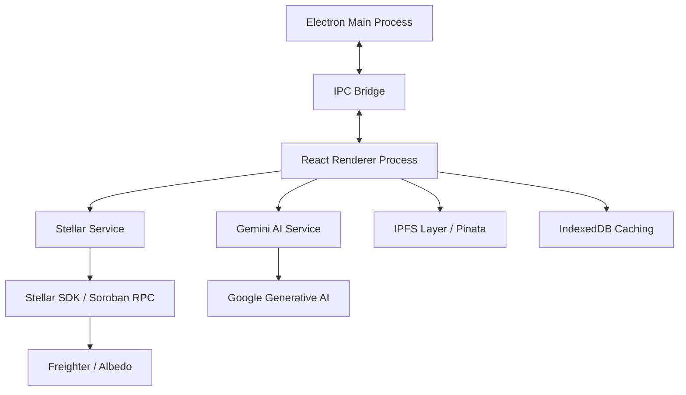

<div align="center">

# 🌐 SOCIALFLOW

### The Professional Nexus for Social Media Management & Web3 Promoting

**Engineering the future of decentralized creator economies with Gemini AI and Stellar.**

[](https://stellar.org)
[](https://deepmind.google/technologies/gemini/)
[](https://www.electronjs.org/)
[](LICENSE)

[Exploration Guide](#-exploration-guide) • [Architecture](#-system-architecture) • [Roadmap](#-strategic-roadmap) • [Contributors](#-developer-ecosystem)

</div>

---

## ⚠️ Moderation Behavior

> **This section documents the absence of moderation, not the presence of it. Read before deploying.**

### Current State — ❌ No Moderation Exists

There is **no content moderation layer** in this codebase. No moderation modes, no middleware, no content policy enforcement, and no provider integrations (e.g. OpenAI Moderation API, Google SafeSearch, Azure Content Safety) have been implemented.

This means:

- All user-supplied input (captions, topics, message replies) is passed directly to the Gemini API without any pre-screening.
- All AI-generated output is returned directly to the UI without any post-processing or filtering.
- There is no concept of a moderation mode (strict, permissive, off) — the system has no configuration surface for moderation at all.
- Missing or invalid API keys affect only the AI generation features (`generate_caption`, `generate_reply`). There is no separate moderation provider key because there is no moderation provider.

### Fail-Open vs Fail-Closed

Because no moderation layer exists, the system is **permanently fail-open**:

| Scenario | Behavior | Operational Implication |
|---|---|---|
| `API_KEY` valid | Content generated and returned unmoderated | Policy violations in AI output are possible |
| `API_KEY` missing or invalid | AI generation fails; UI shows an error string | No content produced, so no moderation risk — but service is degraded |
| Moderation provider key missing | N/A — no moderation provider is configured | No change in behavior; moderation was never active |

**Fail-open** means content passes through without filtering when a moderation check cannot be performed. This is the current permanent state — not a fallback, but the only state.

**Fail-closed** (blocking content when moderation is unavailable) is not implemented and would require building a moderation layer first.

### Operational Implications

- Do not deploy SocialFlow in any context where content policy enforcement is required (e.g. platforms accessible to minors, regulated industries) until a moderation layer is implemented.
- The Gemini API applies Google's own usage policies and may refuse certain requests, but this is not a substitute for application-level moderation.

### Incident Response

Because no moderation system exists, there is no moderation outage to detect or recover from. If you are building toward a moderated deployment:

1. **Detecting a future moderation outage** — instrument your moderation middleware to emit a structured log event on every check failure. Alert on error rate exceeding a threshold over a rolling window.
2. **When moderation is degraded** — decide at design time whether your system should fail-open (allow content, log for review) or fail-closed (block content, return error to user). Document this in your deployment runbook.
3. **Re-enabling after key rotation or provider recovery** — rotate the moderation provider key in your secrets manager, redeploy or hot-reload the service, then verify with a known-bad test payload that moderation is active before re-opening traffic.

> These steps are forward-looking guidance for when moderation is eventually implemented. None apply to the current codebase.

---

## 🔏 Upload Signature Security

> **This section documents the absence of upload signature verification, not the presence of it. Read before deploying.**

### Current State — ❌ No Upload Signing or Verification Exists

SocialFlow has no server-side upload handler and no signature verification system. The only upload-related code is in `components/MediaLibrary.tsx`, which uses `URL.createObjectURL()` to preview files locally in the browser. No file is transmitted to any server, signed, or verified.

This means:

- There is no upload endpoint — files never leave the client.
- There is no signing algorithm, no signing key, and no required env vars for upload security.
- There are no demo/bypass flags (e.g. `SKIP_SIGNATURE_VERIFY`) because there is no verification system to bypass.
- Pinata and IPFS are referenced in the roadmap spec (`design.md`, `requirements.md`) as planned future features — they are not implemented.

### Production Checklist

No upload security checklist applies to the current codebase. When a server-side upload handler and signature verification are implemented, this section should document:

- Required env vars (signing key, algorithm, expiry)
- Key rotation guidance
- ⛔ Forbidden in production: any flag that disables signature enforcement (e.g. `SKIP_SIGNATURE_VERIFY=true`, hardcoded demo secrets)

### Signature Verification Flow

No verification flow exists. When implemented, this section should describe how a valid upload request is signed, how the server verifies the signature, and what error response is returned on failure.

### Threat Model

No upload threat model applies to the current codebase. When server-side uploads are introduced, this section should cover what attacks signature verification prevents (unauthorized uploads, payload tampering) and what it does not protect against (scope boundaries).

> All subsections above are forward-looking guidance for when upload signing is eventually implemented. None apply to the current codebase.

---

## 🔒 Health & Config Route Access Policy

> **This section documents the absence of health endpoints and config routes, not the presence of them. Read before configuring a reverse proxy.**

### Current State — ❌ No HTTP Server Exists

SocialFlow is a **desktop application** (Electron). It does not run an HTTP server and exposes no network-facing routes of any kind. This means:

- There are no health endpoints (`/health`, `/ready`, `/live` or equivalent).
- There are no config mutation routes.
- There is no auth middleware, no RBAC, and no token validation — because there is no server to protect.
- There is nothing to place behind a reverse proxy.

The Electron main process (`electron/main.js`) creates a `BrowserWindow` and loads either the Vite dev server (development) or a local `dist/index.html` (production). No TCP port is opened by the application itself.

### Route Access Policy Table

| Route | Method | Auth Required | Required Role/Scope | Notes |
|---|---|---|---|---|
| — | — | N/A | N/A | No routes exist. No HTTP server is present in this codebase. |

### Config Mutation Authorization

No config mutation endpoints exist. There is no API surface to authorize or restrict.

### Reverse Proxy Hardening

Because no HTTP server exists, no reverse proxy configuration is needed or applicable. If a future version of SocialFlow introduces a server process, this section should be updated with:

- A route access policy table covering all exposed endpoints
- Auth requirements per route
- Nginx/Caddy/Traefik snippets blocking any config mutation routes from public access

> This guidance is forward-looking. None of it applies to the current codebase.

---

## 💎 The SocialFlow Paradigm

SocialFlow is a state-of-the-art **social media management and promoting application** designed to restore sovereignty to digital creators. By converging Large Language Models (LLMs) with Decentralized Ledger Technology (DLT), we provide a suite of management, orchestration, and economic primitives that are transparent, non-custodial, and hyper-automated.

### 🌐 Strategic Value Propositions

* **Cognitive Automation**: Leveraging Gemini 1.5/2.5 Pro for high-fidelity content synthesis and community sentiment alignment.
* **Economic Sovereignty**: Direct implementation of the Stellar network for instantaneous, sub-cent settlement of tips, rewards, and asset transfers.
* **Verifiable Influence**: Transitioning social metrics from proprietary database entries to immutable on-chain attestations via Soroban smart contracts.

---

## 🚀 Architectural Pillars

### 🤖 1. Synergetic AI Suite

Our intelligence layer transcends simple generation, providing a sophisticated creative workflow:

* **Predictive Copywriting**: Multi-platform caption synthesis optimized for specific engagement KPIs (TikTok, IG, X, LinkedIn).
* **Intelligent Response Protocol**: Automated sentiment analysis and professional-grade reply generation to maintain 24/7 community presence.
* **Media Optimization**: AI-driven suggestions for hashtags and visual positioning to maximize algorithmic reach.

### ⛓️ 2. Decentralized Economic Primitives (Stellar)

We utilize the Stellar Network to build deep financial integration into the social workflow:

* **Non-Custodial Integrity**: Direct integration with **Freighter** and **Albedo**. SocialFlow serves as a secure gateway, never accessing private keys or sensitive signing material.
* **Asset Minting Engine**: Deploy fixed or inflationary brand tokens in seconds. Manage supply, distribution logic, and trustlines directly within the dashboard.
* **Programmable NFTs**: Bridge creative content to the blockchain with IPFS-anchored metadata and on-chain provenance tracking.
* **Unified Settlement**: Multi-asset support (XLM, USDC, Custom Assets) for global, near-instant content monetization.

### 📑 3. Soroban-Powered Smart Campaigns

Move beyond manual rewards to code-enforced growth:

* **Automated Engagement Distribution**: Smart contracts that autonomously reward verifiable community engagement.
* **Budgeting Treasuries**: Securely lock promotion budgets in transition-verified on-chain accounts, releasing funds only upon milestone completion.
* **Public Verification**: Generate cryptographic proof of post-performance, allowing for transparent 3rd-party audits.

---

## 🛠️ System Architecture

SocialFlow is architected as a robust, secure **Electron Desktop Application**, providing local-first data integrity for blockchain operations.



---

## 🗺️ Strategic Roadmap & Milestones

The SocialFlow evolution is meticulously categorized into functional modules:

| Milestone | Title | Strategic Focus | Technical Deliverables |
| :--- | :--- | :--- | :--- |
| **P1** | **Foundation** | Core Protocol Bridge | Wallet APIs, Horizon Bridge, IPC Security Protocol |
| **P2** | **Identity** | Decentralized Sovereign Identity | DIDs, Cryptographic Attestations, Social Linking |
| **P3** | **Liquidity** | Economic Primitives | Asset Minting, Batch Trustlines, Path Payments |
| **P4** | **Collectibles** | Content Bridge | IPFS Integration, NFT Minter, Metadata Standards |
| **P5** | **Automation** | Smart Campaign Logic | Soroban Integration, Reward Automation, Treasuries |
| **P6** | **Intelligence** | Performance & Audit | Desktop Push, Real-time RPC Streaming, Audit Export |

---

## 👩‍💻 Developer Ecosystem

SocialFlow is built by a community of high-level contributors. We utilize a **Modular Issue System** to ensure parallel development of decoupled features.

* **Engineering Tasks**: Detailed granular issues are documented in [.kiro/specs/stellar-web3-integration/tasks.md](.kiro/specs/stellar-web3-integration/tasks.md).
* **Implementation Strategy**: Architecture decisions are outlined in [.kiro/specs/stellar-web3-integration/implementation_plan.md](.kiro/specs/stellar-web3-integration/implementation_plan.md).

### Deployment Environment

```bash
# Clone and Initialize
git clone https://github.com/your-org/socialflow.git
cd socialflow && npm install

# Provision Environment
# Create .env.local with API_KEY and PINATA_SECRETS

# Launch Development Environment
npm run electron:dev
```

---

<div align="center">
  <p><strong>Redefining the digital creator economy through decentralized engineering.</strong></p>
  <p>Built by SocialFlow Labs & The Stellar Global Community</p>
</div>
